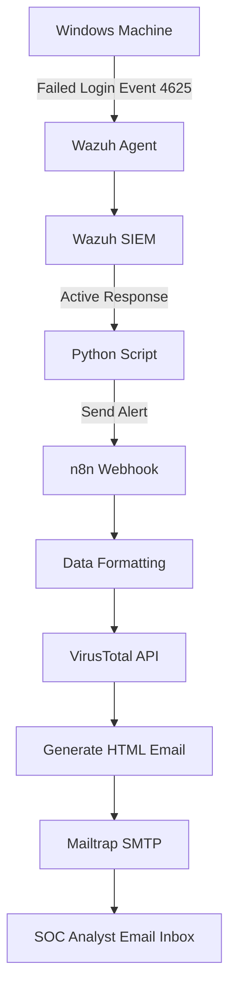

# 🔐 AI-Powered SOC L1 Analyst Prototype  

Automated detection and alerting system for **failed logins (Event ID 4625)** using **Wazuh, n8n, Python, and VirusTotal API**.  
This project demonstrates how Security Operations Center (SOC) tasks can be automated to reduce manual monitoring effort and improve real-time response.  

---

## 🚨 Problem Statement  

Organizations face frequent brute-force login attempts and unauthorized access.  
Manual monitoring of logs is:  
- Time-consuming ⏳  
- Error-prone ⚠️  
- Not scalable ❌  

👉 There is a need for an **automated SOC solution** to:  
- Detect failed login attempts in real time  
- Enrich alerts with threat intelligence  
- Notify analysts instantly with actionable details  

---

## ✅ Solution  

I built an **AI-assisted SOC automation workflow**:  
1. **Wazuh Agent** detects failed logins (Event ID 4625) on Windows.  
2. **Wazuh Active Response** triggers a **Python script**.  
3. Script forwards log data to **n8n webhook**.  
4. **n8n workflow** processes the alert, checks **IP reputation (VirusTotal)**, and generates a formatted HTML email.  
5. **Mailtrap SMTP** delivers the alert to the analyst.  

This reduces manual monitoring effort and ensures **real-time, enriched alerts**.  

---

## 🛠️ Tech Stack  

- **SIEM**: Wazuh (Ubuntu server, Azure VM)  
- **Log Source**: Windows Agent (Event Viewer – Event ID 4625)  
- **Active Response**: Python script (forwards alerts to n8n)  
- **Automation**: n8n (low-code orchestration)  
- **Threat Intelligence**: VirusTotal API  
- **Email Service**: Mailtrap SMTP (for safe testing)  
- **Language**: Python, JavaScript (Code Node in n8n)  

---

## 🔄 Workflow  

### Step 1: Failed Login Detected  
- A user enters a wrong password → **Windows logs Event ID 4625**  
- Wazuh agent forwards the log to SIEM  

### Step 2: Active Response Triggered  
- Wazuh Active Response runs a **Python script**  
- Script sends alert → **n8n webhook**  

### Step 3: n8n Processing  
- Webhook receives log data  
- Fields are cleaned and formatted  
- **VirusTotal API** checks IP reputation  
- Result is structured into an **HTML alert**  

### Step 4: Email Notification  
- n8n sends email via **Mailtrap SMTP**  
- Analyst receives a detailed alert with log + reputation result  

---

## 📡 High-Level Architecture  

---

## ✉️ Why Mailtrap Instead of Gmail?  

- **Gmail SMTP** requires production-ready domain + complex security configs (OAuth, App Passwords, TLS).  
- My project runs on **localhost (development mode)** → Gmail setup is not reliable.  

**Mailtrap** is designed for safe email testing:  
- Captures emails in a sandbox  
- No risk of sending real emails accidentally  
- Easy to debug and inspect alerts  

👉 Once deployed in production, I can switch to **Gmail/Outlook SMTP**.  

---

## 🚀 Future Improvements  

- Add more **Wazuh rules** (privilege escalation, file integrity monitoring, etc.)  
- Integrate with **production email services** (Gmail/Outlook SMTP)  
- Add **SIEM dashboards** (Kibana/Grafana) for visualization  
- Use **AI/LLMs** for log summarization & automated recommendations  
- Connect with **ticketing systems** (Jira, ServiceNow) for automated incident creation  

---

## 📌 Summary  

This project is a **mini SOC automation prototype**:  
- Detects failed logins (4625) in real time  
- Enriches alerts with **VirusTotal reputation check**  
- Sends structured alerts via **email**  
- Demonstrates real-world SOC automation using **SIEM + Automation + Threat Intelligence**  

---

